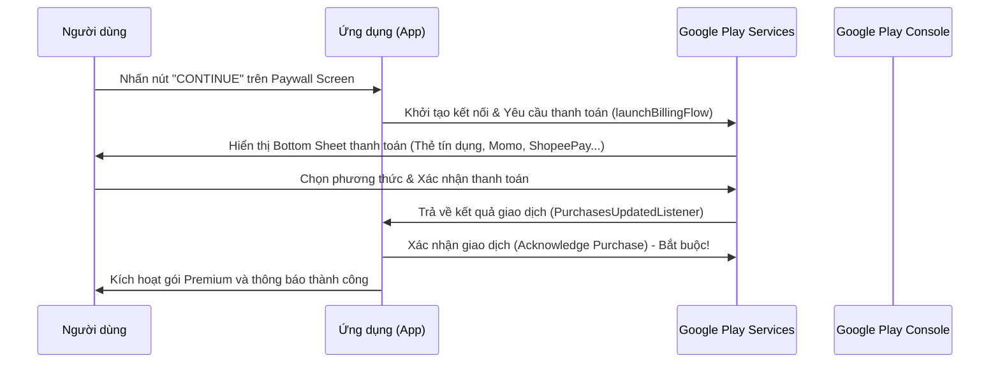

# Kế hoạch triển khai Google Play Billing (Thanh toán trên Google Play)

Tài liệu này hướng dẫn cách tích hợp Google Play Billing Library để người dùng có thể thực hiện thanh toán, liên kết thẻ ngân hàng/ví điện tử và mua các gói Premium (Weekly, Yearly, Monthly) trực tiếp qua Google Play Store (như hiển thị trên hộp thoại thanh toán của Google).

## Tổng quan về luồng hoạt động của Google Play Billing



---

## Các bước cấu hình & Tích hợp chi tiết

### Bước 1: Thiết lập trên Google Play Console (Cửa hàng ứng dụng)
1. Cần có tài khoản **Google Play Console** dành cho nhà phát triển.
2. Tạo ứng dụng của bạn trên Console.
3. Vào mục **Monetize** -> **Products** -> **Subscriptions** và tạo các sản phẩm với ID cụ thể:
   - `premium_weekly`: Gói tuần (92.000 đ)
   - `premium_yearly`: Gói năm (929.000 đ)
   - `premium_monthly`: Gói tháng (229.000 đ)

---

### Bước 2: Tích hợp thư viện vào Code ứng dụng

#### [MODIFY] [build.gradle.kts](file:///d:/chplay/AIInsectIdentifierPro/app/build.gradle.kts)
- Thêm dependency của thư viện Google Play Billing:
  `implementation("com.android.billingclient:billing-ktx:7.0.0")`

#### [MODIFY] [AndroidManifest.xml](file:///d:/chplay/AIInsectIdentifierPro/app/src/main/AndroidManifest.xml)
- Thêm quyền thanh toán vào file manifest (nếu thư viện chưa tự động thêm):
  `<uses-permission android:name="com.android.vending.BILLING" />`

---

### Bước 3: Cài đặt BillingHelper/BillingManager

#### [NEW] [BillingManager.kt](file:///d:/chplay/AIInsectIdentifierPro/app/src/main/java/com/kynv1/aiinsectidentifierpro/data/billing/BillingManager.kt)
- Lớp helper để quản lý vòng đời kết nối với Google Play:
  - **Khởi tạo kết nối**: Thiết lập `BillingClient.newBuilder(context)`.
  - **Lắng nghe giao dịch**: Cài đặt `PurchasesUpdatedListener` để nhận phản hồi khi người dùng thanh toán.
  - **Truy vấn giá**: Truy vấn thông tin giá gói thực tế từ Google Play thông qua `QueryProductDetailsParams`.
  - **Xác nhận giao dịch (Acknowledge)**: Thực hiện gọi `BillingClient.acknowledgePurchase` để xác nhận thanh toán hợp lệ (nếu không xác nhận, Google sẽ tự động hoàn tiền cho người dùng sau 3 ngày).

---

### Bước 4: Kết nối với Paywall Screen

#### [MODIFY] [PaywallScreen.kt](file:///d:/chplay/AIInsectIdentifierPro/app/src/main/java/com/kynv1/aiinsectidentifierpro/ui/screens/premium/PaywallScreen.kt)
- Thay thế hàm click trực tiếp bằng việc gọi hàm kích hoạt luồng thanh toán thực tế của `BillingManager`:
  ```kotlin
  // Thay vì: homeViewModel.purchasePremium()
  // Chúng ta sẽ gọi:
  billingManager.launchBillingFlow(activity, selectedProductId)
  ```

---

## Kế hoạch kiểm thử (Verification Plan)

Để test chức năng thanh toán trên Google Play mà không cần tốn tiền thật, chúng ta thực hiện theo các bước:
1. **Thiết lập License Testing**:
   - Thêm tài khoản email test của bạn vào danh sách **License Testers** trong cài đặt Google Play Console.
2. **Tải phiên bản test lên Google Play**:
   - Tạo bản dựng App Bundle (`.aab`) ký chữ ký số thật.
   - Upload lên kênh **Internal Testing** (Thử nghiệm nội bộ) trên Play Console.
3. **Thanh toán giả lập**:
   - Dùng tài khoản email test đã đăng ký để tải app từ Play Store về điện thoại.
   - Nhấn "CONTINUE" -> Google Play sẽ hiển thị bottom sheet kèm theo phương thức thanh toán là **"Test card, always approves"** (Thẻ thử nghiệm, luôn chấp nhận thanh toán) mà không trừ tiền tài khoản thật của bạn.
